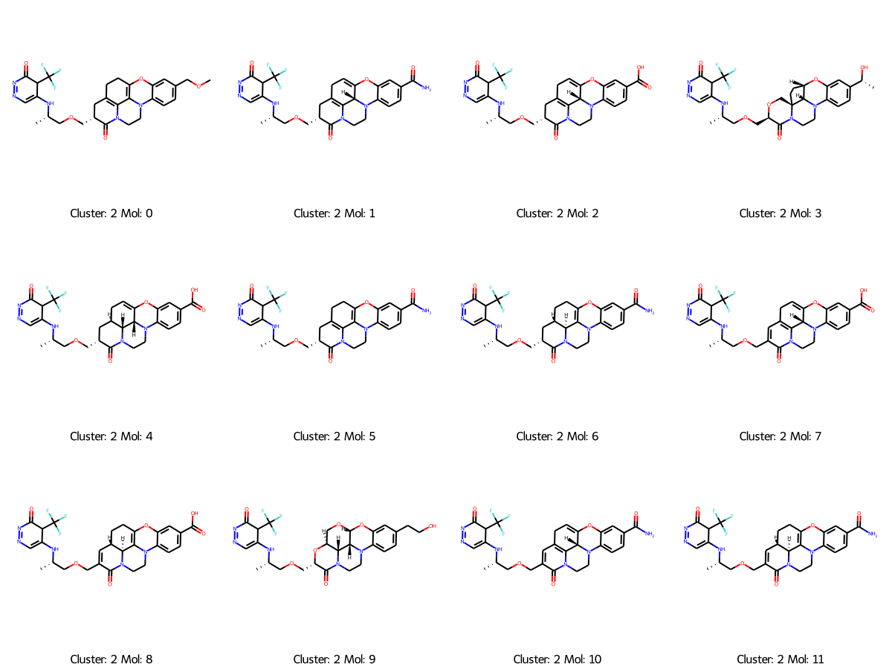

This protocol is used for performing structural modification of ligands with Delete method. 


## Define Replacement

### Discover patterns with pharmacophore modeling. 

## Use Delete

Download the Delete and follow the guidelines to build the surf_maker environment and delete environment.

Scenario: if you have a target on which to design, and you have a prepared fragment. You can generate a series of possible modifications using Delete. The used checkpoint can be downloaded [here](https://doi.org/10.5281/zenodo.8104141). 

```python
python gen_all_epoch_to_1_target.py
```

Then you would get a series of modified molecules. 

## Predicted Proteins

For a number of reasons, some proteins may not have the experimental conformations, such as parp7. To use Delete for this case, you need to predict its conformation with AlphaFold2 or homology modeling. 

Once you get the AlphaFold-predicted conformations, they often contain some unphysical local structures, like twisted rings or something. The geometry optimization is suggested. I have prepared an OpenMM-based code for doing this automatically. 

The first thing is to clean the protein file, like replacing nonstandard residues and repairing atoms and residues.

```bash
pdbfixer protein.pdb --replace-nonstandard --add-atoms=all --add-residues
```

Then, perform local geometry optimization. 

```bash
python ./protein-geom/protein_geom_opt.py --input_pdb xxx --out_name xxx
```

(Optional) You can run the protein conformation simulation with explicit solvent. 

```
python ./protein-geom/protein_geom_opt.py --input_pdb xxx --out_name xxx
```

(Optional) Sometimes, you may want to perform the protein-ligand simulation to explore more possibilities, like optimizing molecules from different conformational states. 

```bash
To be continued. 
```


## Filter the molecules 

### QSAR

### Mol Prop

### Docking 

### MM-PBSA

### FEP

### Expert Selection Visualization

#### T-Map

One way to visualize the generated molecules is by mapping them with the t-map, please refer to the following Git for implementation. The different color could be attributed to different properties. 

```python
https://github.com/HaotianZhangAI4Science/AI-Physics-DrugDiscovery/tree/main/chemical_space/tmap
```

<div align=center>

</div>


#### Similarity Clustering

You can use a similarity matrix to cluster molecules, and select several ones in each cluster. I have provided an example in the following repository. 

```
./clustering/molecules_cluster.ipynb
```

<div align=center>

</div>


#### Scaffold Analysis

ChemBio   ` https://chembioserver.vi-seem.eu/Dendrogram.php`

Scaffold Hunter. `https://scaffoldhunter.sourceforge.net/`

chemaxon ` https://chemaxon.com/discovery-tools`

chemmine  ` http://chemmine.ucr.edu/about/`

ChemBio is my first choice since it is quite easy to use. 


