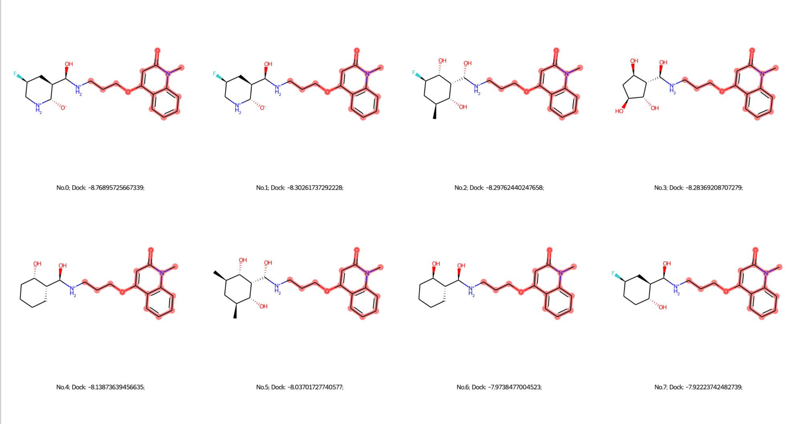

This protocol is used for performing structural modification of ligands with Delete method. 


## Define Replacement

### Discover patterns with pharmacophore modeling. 

## Use Delete

Download the Delete and follow the guidelines to build the surf_maker environment and delete environment.

Scenario: if you have a target on which to design, and you have a prepared fragment. You can generate a series of possible modifications using Delete. The used checkpoint can be downloaded [here](https://doi.org/10.5281/zenodo.8104141). 

```python
python gen_all_epoch_to_1_target.py
```

Then you would get a series of modified molecules. 

## Fix Proteins (Optional)

For a number of reasons, some proteins may not have the experimental conformations, such as parp7. To use Delete for this case, you need to predict its conformation with AlphaFold2 or homology modeling. 

Once you get the AlphaFold-predicted conformations, they often contain some unphysical local structures, like twisted rings or something. The geometry optimization is suggested. I have prepared an OpenMM-based code for doing this automatically. 

The first thing is to clean the protein file, like replacing nonstandard residues and repairing atoms and residues.

```bash
pdbfixer protein.pdb --replace-nonstandard --add-atoms=all --add-residues
```

Then, perform local geometry optimization. 

```bash
python ./protein-geom/protein_geom_opt.py --input_pdb xxx --out_name xxx
```

(Optional) You can run the protein conformation simulation with explicit solvent. 

```
python ./protein-geom/protein_geom_opt.py --input_pdb xxx --out_name xxx
```

(Optional) Sometimes, you may want to perform the protein-ligand simulation to explore more possibilities, like optimizing molecules from different conformational states. 

```bash
To be continued. 
```

## Fail to Generate Molecules? 

## Filter the molecules 

### QSAR

### Mol Prop

### Docking 

You can use a series of docking software, where the scripts are stored in the `./docking`

### MM-PBSA

### FEP

[OpenFreeEnergy/Lomap: Alchemical mutation scoring map (github.com)](https://github.com/OpenFreeEnergy/Lomap#lomap)

### Expert Selection Visualization

#### T-Map

One way to visualize the generated molecules is by mapping them with the t-map, please refer to the following Git for implementation. The different color could be attributed to different properties. 

```python
https://github.com/HaotianZhangAI4Science/AI-Physics-DrugDiscovery/tree/main/chemical_space/tmap
```

<div align=center>

</div>


#### Similarity Clustering

You can use a similarity matrix to cluster molecules, and select several ones in each cluster. I have provided an example in the following repository. 

```
./clustering/molecules_cluster.ipynb
```

<div align=center>

</div>


#### Make PDF analysis. 

You can use the `./clustering/sort_by_docking.py` or `./clustering/sort_by_similarity.ipynb` to sort the molecules into PDF format for experts' review. The generated example are outlined as follows:

<div align=center>

</div>

#### Scaffold Analysis

ChemBio   ` https://chembioserver.vi-seem.eu/Dendrogram.php`

Scaffold Hunter. `https://scaffoldhunter.sourceforge.net/`

chemaxon ` https://chemaxon.com/discovery-tools`

chemmine  ` http://chemmine.ucr.edu/about/`

ChemBio is my first choice since it is quite easy to use. 


### Select Chemicals from Libraries. 

Synthesizing designed molecules is not available for some researchers. Therefore, we provide the script to select the molecule most similar to the generated one. This protocol indeed has some advantages, including securing the drug-like properties of ligands, but it sacrifices the chemical space exploration abilities, sometimes leading to the missing of hit compounds. 

#### Download Libraries

There are plenty of choices of ligand libraries, such as CHEMBL, ZINC, ChemDiv, and Specs. You should download them from the original resources in the `./library`.

**ChemDiv**: ChemDiv contains several .sdf files,  including `DC01_400000.sdf`, `DC02_400000.sdf`, `DC03_332268.sdf`, `IC_136982.sdf`, and `NC_292464.sdf`. You can use obabel to merge them together. 

```shell
obabel DC01_400000.sdf, DC02_400000.sdf, DC03_332268.sdf, IC_136982.sdf, NC_292464.sdf -O chemdiv.sdf
```

**Specs**: Specs only has one file, whereas mine is named `Specs_ExAcD_Aug_2020.sdf`. 

**ZINC**: Zinc needs you to download the files, where the command is obtained from the [ZINC Website](https://zinc.docking.org/). I have prepared a download.sh makingscript in the `./library/Zinc_download.ipynb`. 

#### Search the Most Similar Molecules 

Our script employs commercial software, OpenEye, for fast-searching compound libraries. 

```shell
# Make fingerprints of libraries. Here we show the chemdiv example. Try other libraries based on your own needs. 
python ./openeye/makefastfp.py -in ./library/chemdiv.sdf -fpdb ./library/chemdiv.fpbin

# Once you obtain the fingerprint database, you can search the query mol using the following script. 
python ./openeye/searchfastfp.py -fpdb ./library/chemdiv.fpbin -molfname ./library/chemdiv.sdf -query ./library/query.sdf -out hits.sdf -memorytype in-memory
```

#### Search the Molecule Containing the Query Structure

```python
python ./openeye/search_substructure.py --query_sdf query.sdf --library ./library/chemdiv.sdf --save_file ./hit.sdf 
```

