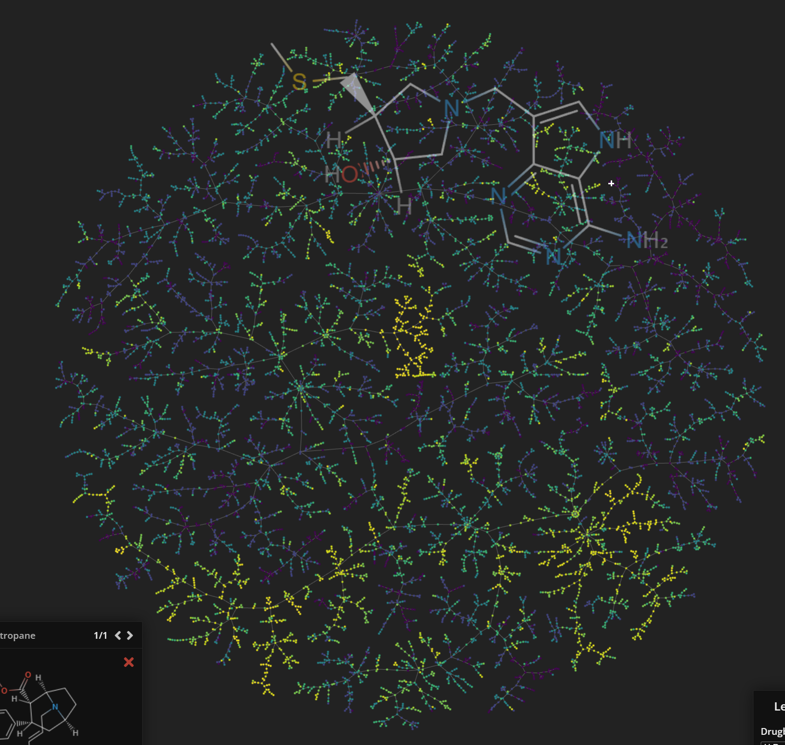

This protocol is used for performing structural modification of ligands with Delete method. 


## Define Replacement

### Discover patterns with pharmacophore modeling. 

## Use Delete

Download the Delete and follow the guildline to build the surf_maker environment and delete environment.

Scenario: if you have a target on which to design, and you have a prepared fragment. You can generate a series possible modifications using Delete. The used checkpoint could be downloaded [here](https://doi.org/10.5281/zenodo.8104141). 

```python
python gen_all_epoch_to_1_target.py
```

Then you would get a series of modified molecules. 

## Filter the molecules 

### QSAR

### Mol Prop

### Docking 

### MM-PBSA

### FEP

### Expert Selection Visualization

One way to visualize the generated molecules is by mapping them with the t-map, please refer to the following Git for implementation. The different color could be attributed to different properties. 

```python
https://github.com/HaotianZhangAI4Science/AI-Physics-DrugDiscovery/tree/main/chemical_space/tmap
```

<div align=center>

</div>


Scaffold 

Scaffold Hunter. `https://scaffoldhunter.sourceforge.net/`

chemaxon ` https://chemaxon.com/discovery-tools`

chemmine  ` http://chemmine.ucr.edu/about/`

ChemBio   ` https://chembioserver.vi-seem.eu/Dendrogram.php`

ChemBio is my first choice since it is quite easy to use. 


